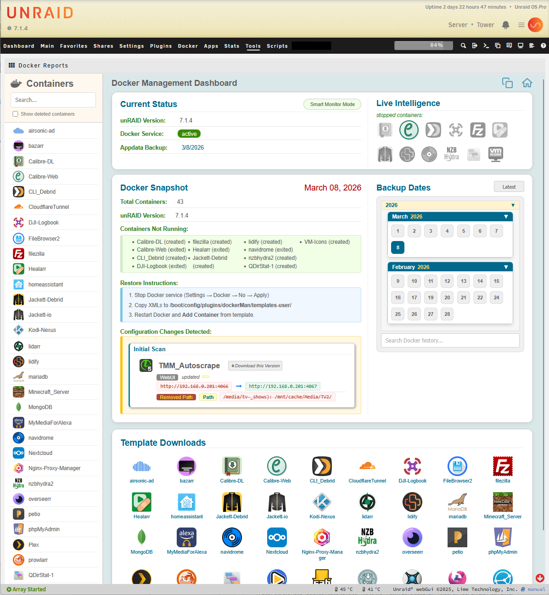
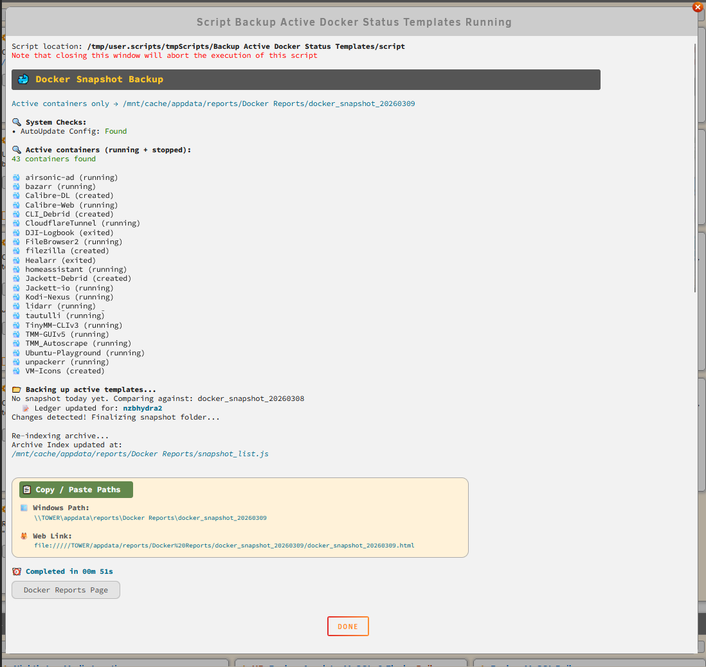

# unRAID Docker Reports & Audit Dashboard




In a nutshell, this provides a complete history and backup of all your Docker template changes for as long as you want. It all operates off a web ui. There are additional features which I will outline at the end.

I created this package with the help of Gemini AI. It took over a month of almost full time work. I think the end results are impressive and for me, it has already been useful. I want to share but with a couple of disclaimers. I am not a master programmer. I know enough to explain what I want, and rudimentary understanding of scripts. I relied completely on AI for this. Because of this, I am not sure I can provide much support or implement features/changes. I will be posting this in my Github for others to fork, and revise. 

Second, very important. This is NOT a "live" status page. The page ONLY gets updated when the User Script is run. This is meant to give you a snapshot of everything that has changed within your docker configurations. As such, each daily snapshot file includes the docker changes detected that day. You can also go back in time, and get every version of the docker templates. You can download the XML file and restore the old version.

This project starts as a UserScript, As a second part of this project, you can implement this as a template, so it works within the Tools page in the unRAID WebUI. In my UserScripts, I have configured this to run Daily. If there are no changes detected on any given day, the script does nothing.

## Overview
Docker Reports is a high-fidelity "Time Machine" for your Unraid Docker templates. It audits your configurations every time it runs, tracking changes to Ports, Paths, and Variables, and even allows you to recover configurations from deleted containers.

📦 **Asset Download:** `unRAID_Docker_Reports.zip` *(See releases/files to download)*

---

## Installation Instructions for Users

### Step 1: Create the Share Folder
Create a folder on your unRAID server where the reports and backups will live. It is recommended to use your cache drive for speed:
```bash
/mnt/user/appdata/reports/DockerReports/
```

### Step 2: Deploy the Assets
Extract the provided ZIP file into the folder you just created. Your structure should look like this:
```text
/mnt/user/appdata/reports/DockerReports/index.html
/mnt/user/appdata/reports/DockerReports/assets/audit_logic.sh
(and other files)
```

### Step 3: Set Permissions
For the script to function, it must have permission to execute the audit engine. Open the Unraid Terminal and run:
```bash
chmod +x /mnt/user/appdata/reports/DockerReports/assets/audit_logic.sh
```

### Step 4: Install the UserScript (The Engine)
1. Install the **UserScripts** plugin from Community Applications.
2. Create a new script named `DockerReports`.
3. Click **Edit Script** and paste the provided script code.
4. Configure the paths at the top of the script (`REPORTS_BASE` and `UNRAID_URL`).
5. Set the schedule to **Daily** or **At Array Start**.
6. Run the script once manually to generate your first report and initialize the database.

### Step 5: Install the Plugin (The Tools Menu)
The plugin integrates the dashboard directly into the Unraid WebUI.
1. Copy the provided `DockerReports.plg` file to the `/config/plugins/` folder on your unRAID Flash drive.
2. In the Unraid Terminal, run the following command to install it without rebooting:
```bash
installplg /boot/config/plugins/DockerReports.plg
```
3. Navigate to **Tools > System Information > Docker Reports** to access your dashboard.

---

## Features

### 🛡️ 1. CA Appdata Backup Integration & Error Reporting
* **Backup Age Monitoring:** Scans your CA Appdata Backup logs (`ab.log`) and displays the date of your last backup in the dashboard header. If the backup is older than your set limit (e.g., 2 days), the date turns red to alert you.
* **Targeted Error Parsing:** Automatically detects `[❌]` (errors) and `[⚠️]` (warnings) inside the backup log.
* **Visual Hover Tooltips:** If a container fails to back up (e.g., skipped volumes), its specific icon appears next to the backup date. Hovering over that icon displays a custom, human-friendly tooltip explaining exactly why it was skipped, so you don't have to dig through raw log files.

### 👻 2. "Ghost" Container Tracking (Deleted Apps)
* **Automatic Deletion Detection:** The script notices when a container's XML template is no longer present on your system and flags it as "Deleted/Uninstalled" in the permanent ledger.
* **Sidebar Toggle:** A "Show deleted containers" checkbox lets you hide or reveal historical containers to keep your sidebar clean.
* **"Load Last Known Config" Engine:** If you click on a deleted container, a dedicated recovery button will search backward through your historical archives to find the exact day before it was deleted. It then displays its final overview, ports, paths, and variables so you can easily rebuild it.

### 🕵️ 3. The Audit Engine & Change Ledger
* **Smart Drift Detection:** Doesn't just blindly copy files. It compares today's XML template against yesterday's, ignoring system-generated IDs, to find meaningful "human" changes.
* **Granular Tracking:** Audits and logs changes to:
  * Ports, Paths (Volumes), and Environment Variables.
  * Extra Parameters and Post Arguments.
  * Network Names and Network Types.
* **System State Sensors:** Actively monitors Unraid's native "AutoStart" settings and the CA plugin's "AutoUpdate" settings, logging exactly when they are enabled or disabled.
* **Before/After Values:** The Ledger displays the exact old value and the new value side-by-side with a clean arrow (`➜`) so you know exactly what a path or variable used to be.

### 🕰️ 4. The "Time Machine" Navigation
* **Smart Archive Calendar:** Organizes your backups into an expanding tree of Years, Months, and Days. (Years are exclusive to prevent clutter, but you can open multiple months simultaneously to compare dates).
* **Global Fuzzy Search:** A search bar that hunts through your entire history ledger and sidebar. Typing a few letters brings up a predictive dropdown of matching containers.
* **"Sticky" Search:** If you search for a container (e.g., "Plex") and click a date in the calendar, your search term travels with you to that past date, automatically filtering the sidebar to highlight your target.
* **"Latest" Quick Jump:** A dedicated button that instantly returns you to the most current system snapshot, closing all historical archives.

### 🖥️ 5. Quality of Life & UI Conveniences
* **Live Container Status:** The dashboard checks the active Docker daemon. Containers that are currently stopped or offline are grouped in a "Live Intelligence" widget, and their icons turn greyscale in the sidebar.
* **One-Click "Edit in Unraid":** Clicking a container's name opens the native Unraid Docker edit page for that specific app in a new tab.
* **Direct XML Downloads:** A button to instantly download the raw `.xml` template for any container on any specific historical date.
* **Copy Path Utilities:** A "Copy Paths" button in the header instantly copies the Windows SMB path (`\\TOWER\appdata\...`) to your clipboard so you can easily browse the raw files in Windows Explorer.
* **Human-Friendly Formatting:** Strips out ugly XML hex codes (like `&#xD;`) and converts them into proper visual line breaks and clean text for easy reading.

### ⚙️ 6. System Efficiency & Native Integration
* **Zero-Waste Storage:** If the script runs and detects zero configuration changes, it safely exits without creating a new backup folder, saving your disk space from redundant clones.
* **Native Plugin Interface:** Deploys as an official Unraid `.plg` file. It registers itself in the Unraid Tools menu, running securely inside the WebGUI via an iframe bridge, making it feel like a native part of the operating system.